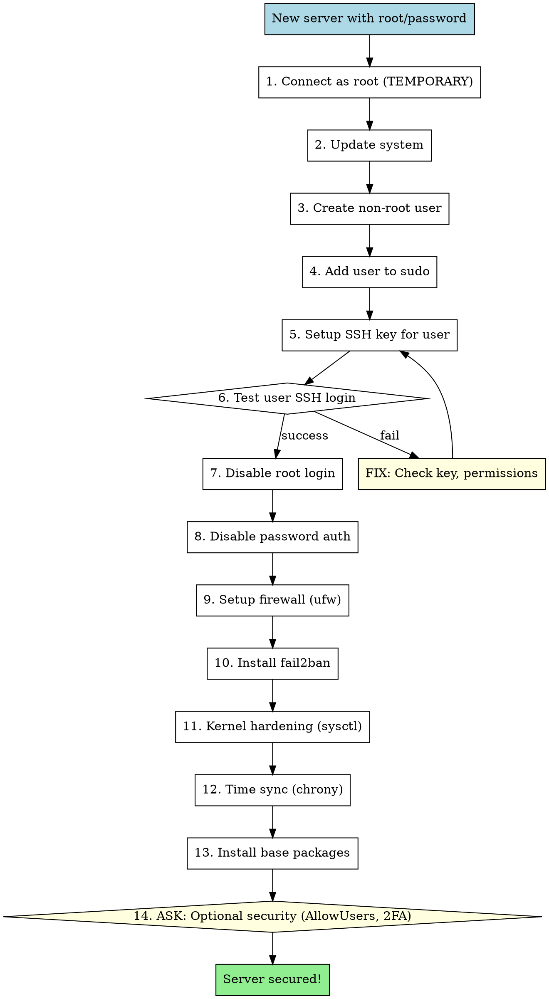
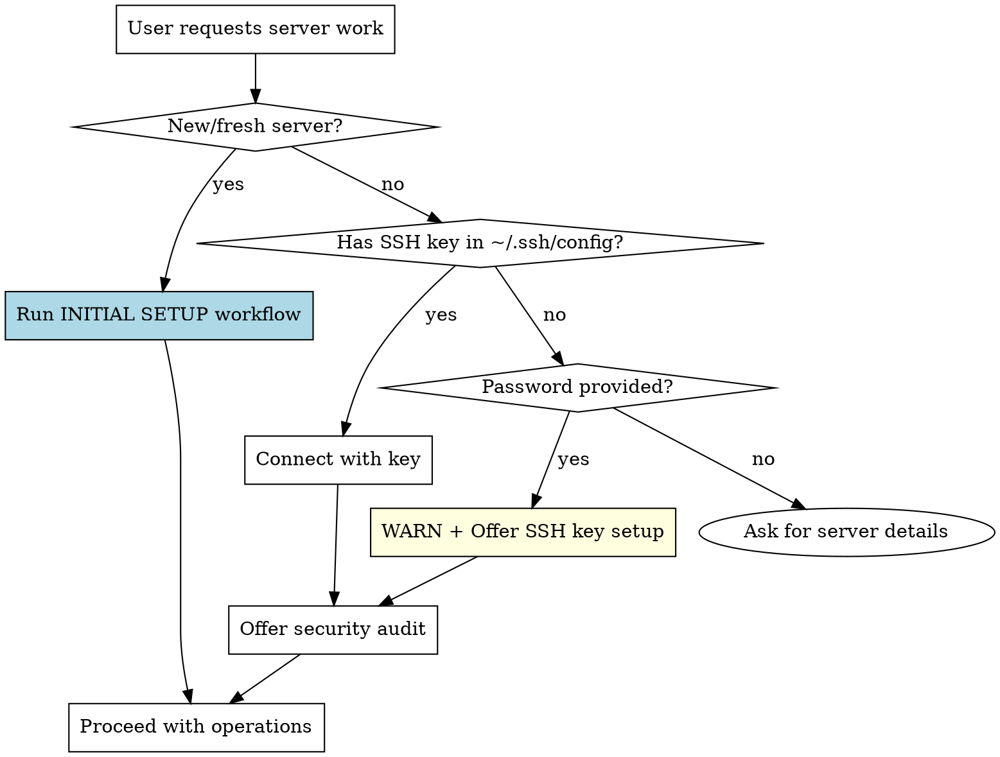

# Server Management

Security-first approach to managing remote servers.

## Core Principles

1. **SSH keys over passwords** — always
2. **Never work as root** — create user, use sudo
3. **Confirm before destructive actions** — always
4. **Audit new servers** — always offer
5. **Never store secrets in skill files** — use ~/.ssh/config

## Initial Server Setup (NEW SERVER)

**This is the PRIMARY use case.** When user gets a new VPS with root + password:



### Step-by-Step Commands

**ASK USER** for: server IP, desired username, SSH key name

#### 1. First connection (root + password, TEMPORARY)
```bash
# On LOCAL machine - generate key first
ssh-keygen -t ed25519 -C "yourname@servername" -f ~/.ssh/SERVERNAME_key

# Connect to server (will ask for password)
ssh root@SERVER_IP
```

#### 2. Update system (on server as root)
```bash
apt update && apt upgrade -y
```

#### 3. Create non-root user
```bash
# Create user with home directory
adduser USERNAME
# Or non-interactive:
useradd -m -s /bin/bash USERNAME
passwd USERNAME
```

#### 4. Add to sudo group
```bash
usermod -aG sudo USERNAME

# Verify
groups USERNAME
```

#### 5. Setup SSH key for new user
```bash
# Create .ssh directory for user
mkdir -p /home/USERNAME/.ssh
chmod 700 /home/USERNAME/.ssh

# Add public key (copy from local ~/.ssh/SERVERNAME_key.pub)
echo "PUBLIC_KEY_CONTENT" >> /home/USERNAME/.ssh/authorized_keys
chmod 600 /home/USERNAME/.ssh/authorized_keys
chown -R USERNAME:USERNAME /home/USERNAME/.ssh
```

#### 6. Test SSH login (CRITICAL - do in NEW terminal!)
```bash
# On LOCAL machine, NEW terminal (keep root session open!)
ssh -i ~/.ssh/SERVERNAME_key USERNAME@SERVER_IP

# Test sudo
sudo whoami  # should output: root
```

**DO NOT proceed if this fails!** Fix permissions first.

#### 7. Disable root login
```bash
# Backup before any changes
sudo cp /etc/ssh/sshd_config /etc/ssh/sshd_config.bak.$(date +%Y%m%d)

# Check for override configs (Ubuntu 22.04+)
# Files in sshd_config.d/ take PRIORITY over main config!
sudo grep -r "PermitRootLogin\|PasswordAuthentication" /etc/ssh/sshd_config.d/ 2>/dev/null
# If found — edit THOSE files too, or remove conflicting overrides

# Edit SSH config
sudo sed -i 's/^PermitRootLogin.*/PermitRootLogin no/' /etc/ssh/sshd_config
sudo sed -i 's/^#PermitRootLogin.*/PermitRootLogin no/' /etc/ssh/sshd_config
```

#### 8. Disable password authentication
```bash
sudo sed -i 's/^PasswordAuthentication.*/PasswordAuthentication no/' /etc/ssh/sshd_config
sudo sed -i 's/^#PasswordAuthentication.*/PasswordAuthentication no/' /etc/ssh/sshd_config

# Test config FIRST, then restart (broken config = locked out!)
sudo sshd -t && sudo systemctl restart sshd
```

#### 9. Setup firewall (ufw)
```bash
sudo apt install -y ufw

# Default policies
sudo ufw default deny incoming
sudo ufw default allow outgoing

# Allow SSH (CRITICAL - do this BEFORE enabling!)
sudo ufw allow ssh
# Or specific port: sudo ufw allow 22/tcp

# Allow other needed ports
sudo ufw allow 80/tcp   # HTTP
sudo ufw allow 443/tcp  # HTTPS

# Enable firewall
sudo ufw enable
sudo ufw status
```

#### 10. Install fail2ban
```bash
sudo apt install -y fail2ban

# Custom config in jail.d/ (avoids duplicate [sshd] sections in jail.local)
sudo tee /etc/fail2ban/jail.d/sshd-custom.conf << 'EOF'
[sshd]
enabled = true
port = ssh
filter = sshd
logpath = /var/log/auth.log
maxretry = 3
bantime = 86400
findtime = 600
EOF

sudo systemctl enable fail2ban
sudo systemctl restart fail2ban
```

#### 11. Kernel hardening (sysctl)
```bash
# Create security config
sudo tee /etc/sysctl.d/99-security.conf << 'EOF'
# IP Spoofing protection
net.ipv4.conf.all.rp_filter = 1
net.ipv4.conf.default.rp_filter = 1

# Ignore ICMP redirects
net.ipv4.conf.all.accept_redirects = 0
net.ipv4.conf.default.accept_redirects = 0
net.ipv4.conf.all.send_redirects = 0
net.ipv4.conf.default.send_redirects = 0

# SYN flood protection
net.ipv4.tcp_syncookies = 1

# Log suspicious packets
net.ipv4.conf.all.log_martians = 1
net.ipv4.conf.default.log_martians = 1

# Ignore ICMP broadcast requests
net.ipv4.icmp_echo_ignore_broadcasts = 1

# Disable source routing
net.ipv4.conf.all.accept_source_route = 0
net.ipv4.conf.default.accept_source_route = 0
EOF

# Apply settings
sudo sysctl -p /etc/sysctl.d/99-security.conf
```

#### 12. Time sync (chrony)
```bash
sudo apt install -y chrony
sudo systemctl enable chrony
sudo systemctl start chrony

# Verify sync
chronyc tracking
```

#### 13. Install base packages
```bash
sudo apt install -y \
    curl \
    wget \
    git \
    htop \
    vim \
    tmux \
    unzip \
    net-tools
```

#### 14. Optional Security — ASK USER

**Always ask user** if they want these additional security measures:

##### Option A: AllowUsers (restrict SSH to specific user)
```bash
# Add to /etc/ssh/sshd_config
echo "AllowUsers USERNAME" | sudo tee -a /etc/ssh/sshd_config
sudo sshd -t && sudo systemctl restart sshd
```
**Benefit:** Only specified users can SSH, even if other users exist on system.

##### Option B: 2FA with Google Authenticator
```bash
# Install
sudo apt install -y libpam-google-authenticator

# Configure for user (run as that user, not root!)
google-authenticator
# Recommended answers:
#   y — use time-based tokens (TOTP)
#   y — update ~/.google_authenticator file
#   y — disallow token reuse (more secure)
#   n — do NOT increase time window (stricter)
#   y — enable rate limiting (3 attempts per 30 sec)

# Edit PAM config
sudo tee -a /etc/pam.d/sshd << 'EOF'
auth required pam_google_authenticator.so
EOF

# Edit SSH config
sudo sed -i 's/^ChallengeResponseAuthentication.*/ChallengeResponseAuthentication yes/' /etc/ssh/sshd_config
sudo sed -i 's/^#ChallengeResponseAuthentication.*/ChallengeResponseAuthentication yes/' /etc/ssh/sshd_config

# Add to sshd_config
echo "AuthenticationMethods publickey,keyboard-interactive" | sudo tee -a /etc/ssh/sshd_config

sudo sshd -t && sudo systemctl restart sshd
```
**Benefit:** Even with stolen SSH key, attacker needs phone code.
**Warning:** If you lose phone access, you may be locked out! Keep backup codes safe.

### Add to local SSH config
```bash
# On LOCAL machine
cat >> ~/.ssh/config << 'EOF'

Host SERVERNAME
    HostName SERVER_IP
    User USERNAME
    IdentityFile ~/.ssh/SERVERNAME_key
    IdentitiesOnly yes
EOF
```

**Done!** Now connect with: `ssh SERVERNAME`

### Optional: Common Software Installation

**Ask user** which they need:

#### Docker + Docker Compose
```bash
# Download and inspect before running as root
curl -fsSL https://get.docker.com -o /tmp/install-docker.sh
less /tmp/install-docker.sh  # inspect if needed
sudo sh /tmp/install-docker.sh
rm /tmp/install-docker.sh

# WARNING: docker group membership = effective root access!
# User can mount host filesystem via: docker run -v /:/host ...
# Only add TRUSTED users to this group.
sudo usermod -aG docker USERNAME

# Verify (re-login required for group to take effect)
docker --version
docker compose version
```

#### Node.js (via nvm)
```bash
# Check latest version at https://github.com/nvm-sh/nvm/releases
curl -o /tmp/install-nvm.sh https://raw.githubusercontent.com/nvm-sh/nvm/v0.40.1/install.sh
less /tmp/install-nvm.sh  # inspect if needed
bash /tmp/install-nvm.sh
rm /tmp/install-nvm.sh
source ~/.bashrc
nvm install --lts
node --version
```

#### Python + pip
```bash
sudo apt install -y python3 python3-pip python3-venv
python3 --version
```

#### Nginx
```bash
sudo apt install -y nginx
sudo systemctl enable nginx
sudo ufw allow 'Nginx Full'
```

#### Certbot (Let's Encrypt SSL)
```bash
sudo apt install -y certbot python3-certbot-nginx
# Usage: sudo certbot --nginx -d domain.com
```

### Initial Setup Checklist

- [ ] SSH key generated locally
- [ ] Non-root user created
- [ ] User added to sudo
- [ ] SSH key copied to user's authorized_keys
- [ ] **TESTED** user SSH login in separate terminal
- [ ] Root login disabled
- [ ] Password auth disabled
- [ ] UFW enabled with SSH allowed
- [ ] fail2ban installed and running
- [ ] Kernel hardening (sysctl) applied
- [ ] Time sync (chrony) installed
- [ ] Base packages installed
- [ ] Local ~/.ssh/config updated
- [ ] **ASKED USER** about AllowUsers
- [ ] **ASKED USER** about 2FA

## Connection Flow



**How to detect "new server":** User says "new VPS", "just got server", "initial setup", "configure new server", or provides root + password.

## SSH Key Setup

When user provides password or no key exists:

```bash
# 1. Generate key (ask user for key name)
ssh-keygen -t ed25519 -C "user@hostname" -f ~/.ssh/SERVER_NAME_key

# 2. Copy to server (requires password ONCE)
ssh-copy-id -i ~/.ssh/SERVER_NAME_key.pub user@server

# 3. Add to ~/.ssh/config
cat >> ~/.ssh/config << 'EOF'
Host SERVER_ALIAS
    HostName server.example.com
    User username
    IdentityFile ~/.ssh/SERVER_NAME_key
    IdentitiesOnly yes
EOF

# 4. Test connection
ssh SERVER_ALIAS "echo 'SSH key auth working!'"
```

**After setup:** Connect using `ssh SERVER_ALIAS` — no password needed.

## Credentials Storage

**NEVER store in skill files:**
- Passwords
- API keys
- Database credentials
- Any secrets

**Store in ~/.ssh/config:**
```
Host myserver
    HostName 192.168.1.100
    User admin
    IdentityFile ~/.ssh/myserver_key
    Port 22
```

**For project-specific secrets:** Use `.env` files (gitignored) or secret managers.

## Dangerous Operations — ALWAYS CONFIRM

Before executing, **explicitly ask user for confirmation:**

| Operation | Risk Level | Example |
|-----------|------------|---------|
| `docker compose restart` | HIGH | Service downtime |
| `docker compose down` | HIGH | Containers stopped |
| `docker system prune` | CRITICAL | Data loss possible |
| `git reset --hard` | CRITICAL | Code loss |
| `rm -rf` | CRITICAL | Data loss |
| Database migrations | HIGH | Schema changes |
| `systemctl restart` | HIGH | Service downtime |

**Confirmation template:**
```
I'm about to execute: [COMMAND]
This will: [CONSEQUENCE]
Server: [SERVER_NAME]

Proceed? (yes/no)
```

## Security Audit

Offer on first connection or when user asks. Four options:

### Lynis Scan (recommended for thorough audit)
```bash
# Install
sudo apt install -y lynis

# Run full audit
sudo lynis audit system

# View results
sudo cat /var/log/lynis.log
sudo cat /var/log/lynis-report.dat
```
**Output:** Detailed report with hardening index score and specific recommendations.

### Quick Checks (three levels):

### Basic Audit (quick)
```bash
# SSH config check
grep -E "PasswordAuthentication|PermitRootLogin" /etc/ssh/sshd_config

# Open ports
ss -tlnp | head -20

# Failed login attempts
grep "Failed password" /var/log/auth.log | tail -10
```

### Extended Audit (recommended)
```bash
# Basic + ...

# Firewall status
ufw status || iptables -L -n | head -20

# fail2ban status
systemctl status fail2ban 2>/dev/null || echo "fail2ban not installed"

# Pending updates
apt list --upgradable 2>/dev/null | head -10

# SSL certificates expiry
find /etc/letsencrypt/live -name "cert.pem" -exec openssl x509 -enddate -noout -in {} \; 2>/dev/null

# Disk usage
df -h | grep -E "^/dev|Filesystem"

# Memory
free -h
```

### Full Audit (thorough)
```bash
# Extended + ...

# Suspicious processes
ps aux --sort=-%cpu | head -15

# World-writable files in web dirs
find /var/www -type f -perm -002 2>/dev/null | head -10

# Users with shell access
grep -E "/bin/(bash|sh|zsh)" /etc/passwd

# Recent logins
last -10

# Listening services
netstat -tlnp 2>/dev/null || ss -tlnp

# Cron jobs (potential backdoors)
for user in $(cut -f1 -d: /etc/passwd); do crontab -u $user -l 2>/dev/null; done | grep -v "^#" | head -20
```

## Common Operations

### Docker Management
```bash
# Status
ssh SERVER "cd PROJECT && docker compose ps"

# Logs
ssh SERVER "cd PROJECT && docker compose logs SERVICE --tail=100"

# Restart (CONFIRM FIRST!)
ssh SERVER "cd PROJECT && docker compose restart SERVICE"

# Rebuild (CONFIRM FIRST!)
ssh SERVER "cd PROJECT && docker compose up -d --build SERVICE"
```

### Deployment
```bash
# Pull latest code
ssh SERVER "cd PROJECT && git pull origin main"

# Full deploy (CONFIRM FIRST!)
ssh SERVER "cd PROJECT && git pull && docker compose up -d --build"
```

### Database
```bash
# Backup (safe)
ssh SERVER "cd PROJECT && docker compose exec -T db pg_dump -U USER DB > backup.sql"

# Migrations (CONFIRM FIRST!)
ssh SERVER "cd PROJECT && docker compose exec backend alembic upgrade head"
```

## Red Flags — STOP Immediately

If you catch yourself thinking:
- "Password is fine for now" — NO, set up SSH key
- "Working as root is faster" — NO, create user first
- "I'll disable root login later" — NO, do it during initial setup
- "Quick restart won't hurt" — STOP, ask confirmation
- "I'll just store the password here temporarily" — NEVER
- "No need to audit, it's a test server" — Test servers get compromised too
- "User said 'do it', no need to confirm" — STILL confirm destructive ops
- "Skip firewall, it's internal network" — NO, always configure ufw

**These thoughts = violation of security principles.**

## Error Handling

| Error | Solution |
|-------|----------|
| "Permission denied (publickey)" | Key not copied or wrong key path |
| "Connection refused" | Check if SSH running, correct port |
| "Host key verification failed" | New server, accept key carefully |
| "Connection timed out" | Firewall, wrong IP, server down |

## Checklist Before Any Server Work

- [ ] Using SSH key (not password)?
- [ ] Server alias configured in ~/.ssh/config?
- [ ] Know what operations will be destructive?
- [ ] Have backup/rollback plan for changes?
- [ ] User confirmed dangerous operations?
